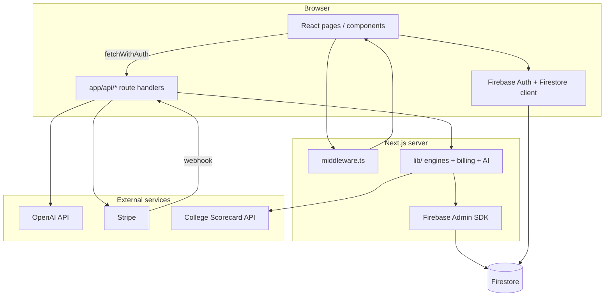

# MyCollegePath — Project Overview

Onboarding guide for developers new to this repository. Everything below is derived from the current codebase unless marked **To confirm**.

---

## 1. Overview

**MyCollegePath** is a web application that helps US high school students navigate college admissions. It combines a deep onboarding questionnaire, college search backed by federal data, AI powered matching (reach / match / safety tiers), personalized roadmaps, essay coaching, a 24/7 AI admissions consultant chat, profile scoring, and subscription billing. The product is operated under the **COMPANTIC** brand and is served at **mycollegepath.ai**.

The problem it solves is fragmented, expensive admissions guidance. Private counseling can cost thousands of dollars, while generic college search tools do not provide end to end strategy. MyCollegePath aims to give students a single private platform for profile building, school selection, planning, and coaching at a lower price point through freemium subscriptions (Free, Starter, Growth, Elite).

**Primary users** are US high school students (grades 9–12 and gap year), especially seniors. Secondary users mentioned in legal copy include parents, mentors, and counselors. The app is English language and US admissions focused (SAT/ACT, Common App context, College Scorecard data).

**How the app is split:**

| Area | URL prefix | Who can access |
|------|------------|----------------|
| Marketing & legal | `/`, `/pricing`, `/privacy`, `/terms`, `/cookies` | Public |
| Onboarding wizard | `/onboarding/step-1` … `/onboarding/step-7` | Public (draft in localStorage until signup) |
| Sign in | `/signin` | Public |
| Authenticated product | `/app/*` | Signed in users who completed onboarding |

The repository is a **Next.js 15** monolith: React UI, API route handlers for server logic, Firebase for auth and persistence, OpenAI for AI features, Stripe for payments, and optional Google Analytics / GTM for marketing analytics.

---

## 2. Core Concepts and Glossary

| Term | Meaning in this project |
|------|-------------------------|
| **Onboarding** | A seven step public wizard (`/onboarding/step-1` … `step-7`) that collects identity, psychology, career direction, academics, activities, and preferences. Draft answers live in `localStorage` until account creation on step 7. |
| **Onboarding snapshot** | The normalized `OnboardingAnswers` object stored on `users/{uid}.onboardingAnswers` in Firestore after signup. Read by matching, roadmap, dashboard, and AI context builders. |
| **Reach / Match / Safety** | Tier labels assigned by the matching engine (`MatchTier` in `lib/matching/types.ts`) indicating how competitive a college is for a given student. |
| **College Scorecard** | US Department of Education college dataset accessed via api.data.gov. Used for search, enrichment, and matching candidates (`lib/scorecard/`). |
| **Matching run** | One execution of the matching engine for a user. Results are saved under `users/{uid}/matches/{runId}` via the Admin SDK. |
| **Roadmap** | A phased plan (tasks, gaps, summary) generated from the student profile. Stored under `users/{uid}/roadmaps/`. |
| **AI Score (My Score)** | A 0–100 readiness score with summary, strengths, and improvements, computed via OpenAI with a numeric fallback (`/api/ai-score/calculate`). |
| **Consultant Chat** | The AI admissions coach (`/app/chat`). Uses profile, favorites, and latest match run as context. |
| **Essay Coach** | Essay draft storage and AI analysis (`/app/essays`, `/api/essays/analyze`). |
| **Compantic Card** | A downloadable PDF identity card on the profile page representing the student within the Compantic ecosystem. |
| **Entitlements** | Per plan feature flags and monthly limits (`lib/billing/entitlements.ts`). Enforced server side via `enforceAndIncrementUsage`. |
| **Session cookie** | HttpOnly cookie `__session` holding the Firebase ID token, set by `POST /api/auth/session` after client sign in. |
| **App shell** | Authenticated layout with sidebar navigation (`components/layout/AppShell.tsx`) wrapping all `/app/*` pages. |
| **First Ten** | Onboarding activation checklist on the dashboard encouraging colleges, matching, roadmap, and first chat (`lib/activation/firstTen.ts`). |

---

## 3. Tech Stack

| Technology | Role in this project |
|------------|----------------------|
| **TypeScript** | Primary language; `strict: true` in `tsconfig.json`. |
| **Next.js 15 (App Router)** | Framework: file based routes in `app/`, API handlers in `app/api/`, server and client components. |
| **React 19** | UI library for pages and components. |
| **Tailwind CSS 3** | Utility first styling; design tokens mirrored in `tailwind.config.ts` and `lib/design/tokens.ts`. |
| **Radix UI** | Accessible primitives (dialog, dropdown, tabs, toast, etc.) under `components/ui/`. |
| **Firebase Client SDK** | Browser auth, Firestore reads/writes for user owned data, Storage for profile photos (`lib/firebase/client.ts`). |
| **Firebase Admin SDK** | Server auth token verification, Firestore writes for matches/roadmaps/billing/rate limits (`lib/firebase/admin.ts`). |
| **OpenAI API** | Chat, matching explanations, roadmap generation, essay analysis, AI score (`lib/ai/openai.ts`). |
| **Stripe** | Subscription checkout and webhooks (`lib/stripe/server.ts`, `app/api/stripe/`). |
| **Zod** | Request validation schemas for API routes (`lib/validation/api.ts`) and onboarding schema types. |
| **College Scorecard API** | External college data (`lib/scorecard/client.ts`). |
| **Framer Motion** | Animations on onboarding and dashboard components. |
| **Jest + Testing Library** | Unit tests (minimal coverage today). |
| **Docker** | Production image build (`Dockerfile`, `output: "standalone"` in `next.config.js`). |

**To confirm:** Production hosting appears to use Azure Container Apps for staging (`scripts/deploy-staging.sh`) while `firebase.json` also defines Firebase Hosting and Functions. The live production URL `mycollegepath.ai` may map to either path.

---

## 4. Architecture

The application follows a **Next.js full stack** pattern: UI routes and API routes colocated under `app/`, shared logic in `lib/`, and presentational/feature components in `components/`.

**Layers:**

1. **Public UI** — Marketing (`components/marketing/`), legal pages, onboarding pages under `app/(public)/`.
2. **Authenticated UI** — Pages under `app/app/` rendered inside `AppShell`; many pages are thin server components that fetch data and delegate to client content components.
3. **API routes** — `app/api/*/route.ts` handlers authenticate via `getSessionUserFromRequest`, validate with Zod, enforce billing/rate limits, call `lib/` engines, and read/write Firestore through Admin SDK.
4. **Client data access** — Direct Firestore from the browser for user owned documents allowed by `firestore.rules` (profile, favorites, essays, chat sessions).
5. **External services** — OpenAI, Stripe, College Scorecard, optional Unsplash for college images.

**Auth flow:**

1. User signs in with Firebase Auth (Google popup or email/password) on the client (`lib/firebase/auth.ts`).
2. Client obtains ID token and `POST`s it to `/api/auth/session`, which sets the `__session` httpOnly cookie.
3. `middleware.ts` checks cookie shape/expiry for `/app/*` routes and redirects unauthenticated users to `/signin`.
4. API routes verify the token with Firebase Admin (`lib/firebase/serverAuth.ts`).
5. Client API calls use `fetchWithAuth` (`lib/auth/fetchWithAuth.ts`) to attach Bearer token and refresh session on 401.

**Billing flow:**

1. User selects a plan on `/app/billing` or `/pricing`.
2. `POST /api/stripe/checkout` creates a Stripe Checkout session using price IDs from `lib/billing/plans.ts`.
3. Stripe webhook (`/api/stripe/webhook`) syncs subscription state to `users/{uid}/billing/subscription`.
4. Feature APIs call `enforceAndIncrementUsage` before expensive operations.



---

## 5. Project Structure

```
mycollegepath/
├── app/                          # Next.js App Router: all routes and API handlers
│   ├── layout.tsx                # Root HTML shell, analytics, global CSS links
│   ├── globals.css               # Tailwind base + custom utilities
│   ├── (public)/                 # Public route group (marketing, onboarding, auth)
│   │   ├── page.tsx              # Landing page (renders LandingPageClient)
│   │   ├── onboarding/step-*/    # Seven step onboarding wizard pages
│   │   ├── signin/, pricing/, privacy/, terms/, cookies/
│   │   └── login/                # Legacy redirects (institution/advisor → signin)
│   ├── app/                      # Authenticated product (/app/*)
│   │   ├── layout.tsx            # Auth + onboarding gate, AppShell wrapper
│   │   ├── dashboard/, colleges/, chat/, essays/, documents/, myroad/
│   │   ├── ai-score/, apply-now/, profile/, billing/, deadlines/, insights/
│   │   └── settings/
│   └── api/                      # REST style route handlers
│       ├── auth/session/         # Session cookie management
│       ├── chat/, matching/, roadmap/, essays/, ai-score/
│       ├── scorecard/, college/  # College data proxies
│       ├── billing/, stripe/     # Subscriptions
│       └── public/               # Unauthenticated marketing metrics
├── components/                   # React components by feature area
│   ├── ui/                       # Shared primitives (button, input, toast, …)
│   ├── layout/                   # AppShell, PublicHeader
│   ├── marketing/, landing/      # Public site
│   ├── onboarding/, profile/    # Profile wizard and editing
│   ├── colleges/, matching/      # College list and matching UI
│   ├── chat/, essays/, roadmap/  # AI features
│   ├── dashboard/, ai-score/     # Home and scoring
│   ├── billing/ (via pages)      # Mostly in app/app/billing
│   └── analytics/                # GA + GTM snippets
├── lib/                          # Business logic, integrations, types
│   ├── firebase/                 # Client, admin, auth, firestore helpers
│   ├── onboarding/               # Schema, storage, validation, step config
│   ├── matching/, roadmap/       # Core engines
│   ├── ai/                         # OpenAI wrapper, chat, admissions prompts
│   ├── scorecard/                # College Scorecard client + cache
│   ├── billing/                  # Plans, entitlements, Stripe sync
│   ├── stripe/                   # Stripe server client
│   ├── dashboard/                # Dashboard data aggregation
│   ├── validation/, errors/      # API schemas and error types
│   └── domain/                   # Thin re-exports grouping domain entry points
├── public/                       # Static assets; compiled CSS bundles
├── scripts/                      # Build helpers and deploy-staging.sh
├── functions/                    # Firebase Functions scaffold (no active exports)
├── docs/                         # Project documentation (this file, backlog, etc.)
├── firestore.rules               # Client Firestore security rules
├── storage.rules                 # Firebase Storage rules
├── middleware.ts                 # Auth gate, www redirect, CSS link headers
├── Dockerfile                    # Production container build
├── jest.config.js                # Jest configuration
├── tailwind.config.ts            # Tailwind theme extensions
└── next.config.js                # Standalone output, image domains, cache headers
```

The `functions/` directory and `.agents/skills/` are present but are not central to day to day app development. The `functions/src/index.ts` file is a Firebase template with no exported triggers.

---

## 6. Key Modules and Features

### Marketing and public site

| What | Where |
|------|--------|
| Landing page | `app/(public)/page.tsx` → `components/marketing/LandingPageClient.tsx` |
| Pricing | `app/(public)/pricing/page.tsx`, `components/marketing/LandingPricingSection.tsx` |
| Live metrics | `GET /api/public/marketing-metrics` → `lib/marketing/publicMetrics.ts` |
| Public layout | `app/(public)/layout.tsx` (`force-dynamic` for full HTML shell) |

### Onboarding (steps 1–7)

| Step | Route | Focus |
|------|-------|-------|
| 1 | `/onboarding/step-1` | Identity, photo, school, graduation year, US state |
| 2 | `/onboarding/step-2` | Psychology and learning preferences |
| 3 | `/onboarding/step-3` | Career and academic direction |
| 4 | `/onboarding/step-4` | GPA, SAT/ACT, AP/IB, rigor |
| 5 | `/onboarding/step-5` | Activities, finances, college preferences |
| 6 | `/onboarding/step-6` | Review |
| 7 | `/onboarding/step-7` | Google or email signup; persists to Firestore |

Key files: `lib/onboarding/schema.ts` (types and defaults), `lib/onboarding/storage.ts` (localStorage draft + Firestore persist), `lib/onboarding/stepConfig.ts` (step titles).

### Authentication

| What | Where |
|------|--------|
| Sign in page | `app/(public)/signin/page.tsx` |
| Firebase auth helpers | `lib/firebase/auth.ts` |
| Session cookie API | `app/api/auth/session/route.ts` |
| Route protection | `middleware.ts` + `app/app/layout.tsx` (`isOnboardingCompleted`) |

### Dashboard

| What | Where |
|------|--------|
| Server page | `app/app/dashboard/page.tsx` |
| UI | `components/dashboard/DashboardContent.tsx` |
| Data | `lib/dashboard/getDashboardData.ts` (readiness %, saved colleges, health metrics) |
| Activation card | `components/dashboard/FirstTenActivationCard.tsx` |

### College list and detail

| What | Where |
|------|--------|
| College list page | `app/app/colleges/page.tsx` → `components/colleges/CollegesPageContent.tsx` |
| Search | `components/colleges/CollegesSearch.tsx` |
| Detail | `app/app/colleges/[id]/page.tsx` → `components/colleges/CollegeDetail.tsx` |
| Scorecard APIs | `app/api/scorecard/search/route.ts`, `app/api/scorecard/college/route.ts` |
| Enrichment | `app/api/college/enrich/route.ts`, `app/api/college/why-fit/route.ts` |

### College matching

| What | Where |
|------|--------|
| UI | `app/app/documents/page.tsx`, `app/app/matching/page.tsx`, `components/matching/` |
| Run API | `POST /api/matching/run` |
| Engine | `lib/matching/engine.ts` (multi agent pipeline over Scorecard candidates) |
| Types | `lib/matching/types.ts` |

### Roadmap (My Roadmap)

| What | Where |
|------|--------|
| Page | `app/app/myroad/page.tsx` → `components/roadmap/MyRoadPageContent.tsx` |
| Generate API | `POST /api/roadmap/generate` |
| Task updates | `app/api/roadmap/tasks/route.ts` |
| Engine | `lib/roadmap/engine.ts` |

### AI Consultant Chat

| What | Where |
|------|--------|
| Page | `app/app/chat/page.tsx` → `components/chat/ChatLayout.tsx` |
| API | `POST /api/chat/route.ts` |
| Domain logic | `lib/ai/admissionsChat.ts`, `lib/ai/chatContext.ts` |
| Client persistence | `users/{uid}/chatSessions` (Firestore client SDK) |

### Essay Coach

| What | Where |
|------|--------|
| Page | `app/app/essays/page.tsx` |
| Analyze API | `POST /api/essays/analyze` |
| Storage | `users/{uid}/essays` subcollection |

### AI Score

| What | Where |
|------|--------|
| Page | `app/app/ai-score/page.tsx` → `components/ai-score/AIScorePageContent.tsx` |
| Calculate API | `POST /api/ai-score/calculate` |
| Leaderboard API | `GET /api/ai-score/leaderboard` |

### Apply Now and Deadlines

| What | Where |
|------|--------|
| Apply tracking | `app/app/apply-now/page.tsx` → `components/apply-now/ApplyNowPageContent.tsx` |
| API | `app/api/apply-now/route.ts` |
| Deadlines | `app/app/deadlines/page.tsx` (placeholder empty state only today) |

### Profile and settings

| What | Where |
|------|--------|
| Profile | `app/app/profile/page.tsx` → `components/profile/ProfilePageContent.tsx` |
| Settings | `app/app/settings/page.tsx` |
| Insights timeline | `app/app/insights/page.tsx` (not in main sidebar nav) |

### Billing

| What | Where |
|------|--------|
| In app billing | `app/app/billing/page.tsx` |
| Catalog API | `GET /api/billing/catalog` (Stripe prices) |
| Checkout | `POST /api/stripe/checkout` |
| Webhook | `POST /api/stripe/webhook` |
| Plan definitions | `lib/billing/plans.ts`, `lib/billing/entitlements.ts` |

---

## 7. Data Model / State

There is **no mock data layer** for core product features. Comments in `lib/dashboard/getDashboardData.ts` explicitly state data is real from Firestore.

### Firestore collections (inferred from code and rules)

| Collection / path | Purpose | Written by |
|-------------------|---------|------------|
| `users/{uid}` | `onboardingAnswers`, `onboardingCompleted`, display fields | Client on signup; server merges |
| `users/{uid}/favorites/{id}` | Saved colleges (newer path) | Client |
| `users/{uid}/matches/{runId}` | Matching run results | Server (Admin SDK) |
| `users/{uid}/roadmaps/{id}` | Generated roadmaps | Server (Admin SDK) |
| `users/{uid}/applyNow/{id}` | Application status per college | Server (Admin SDK) |
| `users/{uid}/billing/subscription` | Stripe plan and status | Server (webhook/sync) |
| `users/{uid}/billing/usage/months/{YYYY-MM}` | Monthly feature usage counters | Server (`enforceAndIncrementUsage`) |
| `users/{uid}/chatSessions/{id}` | Chat threads | Client |
| `users/{uid}/essays/{id}` | Essay drafts and analysis | Client |
| `users/{uid}/collegeNotes/{id}` | Per college notes | Client |
| `studentProfiles/{uid}` | Normalized profile fields (GPA, tests, preferences) | Client |
| `savedColleges/{uid_collegeId}` | Legacy saved colleges | Client |
| `aiScores/{uid}` | Latest AI score documents | Server |
| `rateLimits/{bucket:userId}` | API rate limit windows | Server |

**To confirm:** Exact indexes and composite queries required in Firebase console are not documented in the repo.

### Client local state

| Key | Location | Purpose |
|-----|----------|---------|
| `onboardingAnswers` | `localStorage` via `lib/onboarding/storage.ts` | Draft onboarding before signup |
| `mcp_cookie_consent` | `localStorage` via `lib/analytics/consent.ts` | Analytics consent preferences |
| `activation_first10_flag_{uid}_{step}` | `localStorage` via `lib/activation/firstTen.ts` | Dashboard activation checklist |

### Key TypeScript types

| Type | Defined in |
|------|------------|
| `OnboardingAnswers` | `lib/onboarding/schema.ts` |
| `CollegeMatch`, `MatchTier` | `lib/matching/types.ts` |
| `RoadmapResult`, `RoadmapPhase` | `lib/roadmap/types.ts` |
| `StudentProfile`, `EssayDoc` | `lib/firebase/firestore.ts` |
| `BillingPlan` | `lib/billing/plans.ts` |
| `PlanEntitlements` | `lib/billing/entitlements.ts` |
| `ScorecardCollege` | `lib/scorecard/types.ts` |

### Billing plan matrix (server enforced)

| Plan | Colleges | Chat | Essays | Matching | Roadmap | AI Score |
|------|----------|------|--------|----------|---------|----------|
| free | yes | no | no | no | no | no |
| starter | yes | 20/mo | 2/mo | 2/mo | 2/mo | unlimited |
| growth | yes | 40/mo | 4/mo | 10/mo | 10/mo | unlimited |
| elite | yes | unlimited | unlimited | unlimited | unlimited | unlimited |

Source: `lib/billing/entitlements.ts`.

---

## 8. Local Setup

### Prerequisites

| Requirement | Notes |
|-------------|-------|
| **Node.js 20** | Matches `Dockerfile` base image (`node:20-bookworm-slim`). |
| **npm** | Project uses `package-lock.json`; install via `npm ci` or `npm install`. |
| **Firebase project** | Client config via `NEXT_PUBLIC_FIREBASE_*` vars. **To confirm:** production project ID appears to be `mycollegepath-660df` from `lib/firebase/admin.ts` fallback. |
| **Firebase Admin credentials** | Required for API routes. Options listed below. |
| **OpenAI API key** | Required for chat, matching narrative, roadmap, essays, AI score. |
| **College Scorecard API key** | Required for college search (`COLLEGE_SCORECARD_API_KEY`). |
| **Stripe keys** | Required for billing flows (`STRIPE_SECRET_KEY`, `STRIPE_WEBHOOK_SECRET`). Not yet listed in `.env.example` but required by code. |

### Install and run

```bash
# Clone and enter the repo
cd mycollegepath

# Install dependencies
npm install

# Create local env file from template
cp .env.example .env.local
# Edit .env.local and fill in all required values (see table below)

# Start development server (default http://localhost:3000)
npm run dev
```

### Environment variables

| Variable | Required for local dev | Exposure | Purpose |
|----------|------------------------|----------|---------|
| `NEXT_PUBLIC_APP_URL` | Optional | Public | Canonical app URL; defaults to localhost or Vercel URL |
| `NEXT_PUBLIC_FIREBASE_API_KEY` | Yes (for auth) | Public | Firebase web client |
| `NEXT_PUBLIC_FIREBASE_AUTH_DOMAIN` | Yes | Public | Firebase auth domain |
| `NEXT_PUBLIC_FIREBASE_PROJECT_ID` | Yes | Public | Firebase project ID |
| `NEXT_PUBLIC_FIREBASE_STORAGE_BUCKET` | Yes | Public | Storage bucket |
| `NEXT_PUBLIC_FIREBASE_MESSAGING_SENDER_ID` | Yes | Public | Firebase messaging sender |
| `NEXT_PUBLIC_FIREBASE_APP_ID` | Yes | Public | Firebase app ID |
| `FIREBASE_ADMIN_PROJECT_ID` | Yes (for APIs) | Server only | Admin SDK credential |
| `FIREBASE_ADMIN_CLIENT_EMAIL` | Yes | Server only | Admin SDK credential |
| `FIREBASE_ADMIN_PRIVATE_KEY` | Yes | Server only | Admin SDK private key (`\n` for newlines) |
| `FIREBASE_SERVICE_ACCOUNT_JSON` | Alternative | Server only | Full service account JSON one liner |
| `FIREBASE_SERVICE_ACCOUNT_BASE64` | Alternative | Server only | Base64 encoded service account JSON |
| `serviceAccountKey.json` | Alternative (dev only) | Server only | File in repo root; gitignored; read in non production |
| `OPENAI_API_KEY` | Yes (for AI features) | Server only | OpenAI API |
| `COLLEGE_SCORECARD_API_KEY` | Yes (for colleges) | Server only | api.data.gov key |
| `STRIPE_SECRET_KEY` | For billing | Server only | Stripe secret; `sk_test_` selects test price IDs |
| `STRIPE_WEBHOOK_SECRET` | For webhook testing | Server only | Stripe webhook signing secret |
| `NEXT_PUBLIC_GA_MEASUREMENT_ID` | Optional | Public | Google Analytics 4 |
| `NEXT_PUBLIC_GTM_ID` | Optional | Public | Google Tag Manager container |
| `UNSPLASH_ACCESS_KEY` | Optional | Server only | College hero images |

Admin credential resolution order is implemented in `lib/firebase/admin.ts`: base64 JSON → `FIREBASE_SERVICE_ACCOUNT_JSON` → local `serviceAccountKey.json` (non production only) → Application Default Credentials.

### Other scripts

```bash
# Production build (also concatenates CSS and fixes prerender HTML)
npm run build

# Run production server locally (after build)
npm start

# Lint
npm run lint

# Tests
npm test
npm run test:coverage
```

### Stripe webhook locally

**To confirm:** The repo does not include a documented `stripe listen` command. For local webhook testing you will typically run the Stripe CLI forwarding to `/api/stripe/webhook` and set `STRIPE_WEBHOOK_SECRET` to the CLI signing secret.

---

## 9. Common Workflows

### Add a new public page

1. Create `app/(public)/your-page/page.tsx`.
2. If the page needs the marketing header, follow patterns in `app/(public)/pricing/page.tsx`.
3. Public routes are listed in `middleware.ts` under `PUBLIC_EXACT_PATHS` or `PUBLIC_PREFIX_PATHS` if they should bypass auth (onboarding uses the prefix list).
4. The `(public)/layout.tsx` wraps pages with `StylesheetLinks` and forces dynamic rendering.

### Add a new authenticated page

1. Create `app/app/your-feature/page.tsx`.
2. At the top of the server component, gate on auth:

```typescript
import { redirect } from "next/navigation";
import { getSessionUserFromCookies } from "@/lib/firebase/serverAuth";

export default async function YourPage() {
  const user = await getSessionUserFromCookies();
  if (!user) redirect("/signin?from=/app/your-feature");
  // ...
}
```

3. Add a nav item in `components/layout/AppShell.tsx` `nav` array if it should appear in the sidebar.
4. The page is automatically wrapped by `app/app/layout.tsx` with `AppShell` when the user is signed in and onboarding is complete.

### Add a new API route

1. Create `app/api/your-feature/route.ts` exporting `GET`, `POST`, etc.
2. Authenticate:

```typescript
import { getSessionUserFromRequest } from "@/lib/firebase/serverAuth";

export async function POST(req: NextRequest) {
  const user = await getSessionUserFromRequest(req);
  if (!user) return NextResponse.json({ error: "Unauthorized" }, { status: 401 });
}
```

3. Add a Zod schema in `lib/validation/api.ts` and validate the request body.
4. If the feature is metered, call `enforceAndIncrementUsage(user.uid, "chat")` (or the appropriate `BillingFeature`) from `lib/billing/enforce.ts`.
5. For AI or expensive endpoints, consider `enforceUserRateLimit` from `lib/rateLimit/server.ts`.
6. Call client APIs from the browser with `fetchWithAuth("/api/your-feature", { method: "POST", ... })`.

### Add a UI component

1. Place feature components under `components/<feature>/`.
2. Shared primitives go in `components/ui/` (follow existing `button.tsx`, `input.tsx` patterns).
3. Use `cn()` from `lib/utils.ts` for class names.
4. Use Tailwind tokens (`primary-600`, `bg-main`, `text-muted`, `rounded-card`) from `tailwind.config.ts`.
5. Mark client components with `"use client"` when using hooks, browser APIs, or event handlers.

### Work with onboarding data

1. During the wizard, read/write draft via `getOnboardingDraft()` and `saveOnboardingDraft()` in `lib/onboarding/storage.ts`.
2. On signup (step 7), call `persistOnboardingToFirestore(uid, answers)`.
3. On the server, read answers with `getOnboardingAnswersForServer(uid)` from `lib/firebase/serverFirestore.ts`.

### Add or change a subscription plan

1. Create prices in Stripe dashboard (test and live).
2. Update price IDs in `lib/billing/plans.ts` under `STRIPE_PRICE_IDS`.
3. Update marketing copy in `lib/billing/pricing-features.ts`.
4. Update limits in `lib/billing/entitlements.ts`.

### Debug auth issues

1. Check browser cookies for `__session`.
2. Verify `NEXT_PUBLIC_FIREBASE_*` vars are set (`isFirebaseClientConfigured()` in `lib/firebase/client.ts`).
3. Check server logs for `Firebase Admin: ...` messages from `lib/firebase/admin.ts`.
4. Middleware only validates JWT shape/expiry, not signature; full verification happens in API routes and `getSessionUser`.

### Deploy to staging (Azure)

```bash
bash scripts/deploy-staging.sh
```

Requires Docker, Azure CLI, and env vars in `.env.local`. Builds with `NEXT_PUBLIC_*` build args and pushes to Azure Container Registry. **To confirm:** Production deploy pipeline may differ; see `.github/workflows/docker-acr-staging.yml`.

---

## 10. Conventions

### TypeScript and imports

- Path alias `@/*` maps to repository root (`tsconfig.json`).
- Prefer explicit types for API payloads; Zod schemas in `lib/validation/api.ts` for inbound requests.
- Server only modules are labeled in file comments (e.g. `lib/firebase/serverFirestore.ts`, `lib/firebase/admin.ts`). Do not import Admin SDK code into client components.

### File and route naming

- App Router pages: `page.tsx` inside route folders.
- API handlers: `app/api/<name>/route.ts`.
- Route groups: `(public)` does not affect the URL path.
- Authenticated product lives under `/app` because files are in `app/app/`.

### React patterns

- Server Components by default for pages that fetch with Admin SDK.
- Client Components (`"use client"`) for interactive UI, Firebase client SDK usage, and animations.
- Page files tend to be thin; heavy UI lives in `components/<feature>/`.

### Styling

- Tailwind utility classes; design tokens defined in `tailwind.config.ts` and duplicated in `lib/design/tokens.ts`.
- Common patterns: `rounded-card`, `rounded-button`, `shadow-soft`, `bg-bg-main`, `text-text-primary`.
- Font: Inter loaded in `app/layout.tsx`.
- CSS reliability: multiple safeguards inject `app-shell-layout.css` and `compiled-styles.css` because streamed HTML sometimes omits `<head>` links (Safari/CDN). See comments in `app/layout.tsx` and `middleware.ts`.

### API errors

- Use `RateLimitError`, `ServiceUnavailableError`, `BillingError` from `lib/errors/api.ts` and `lib/billing/enforce.ts`.
- Map to HTTP status with `getApiErrorStatus()` in catch blocks.
- Log server errors with `logApiError()` from `lib/logging/api.ts`.

### Firebase security

- Client writes are restricted by `firestore.rules` to the authenticated user's own documents.
- Billing, matches, and roadmaps are server write only (`allow write: if false` on sensitive subcollections).
- Prefer Admin SDK in API routes for privileged writes.

---

## 11. Testing and Quality

### Tests

| Command | What it runs |
|---------|--------------|
| `npm test` | Jest test suite |
| `npm run test:coverage` | Jest with coverage report in `coverage/` |

Configuration: `jest.config.js` uses `next/jest`, `jsdom` environment, `@/` module mapper, and `jest.setup.js`.

**Current test files (very limited):**

| File | Covers |
|------|--------|
| `lib/utils.test.ts` | `cn()` utility |
| `lib/errors/api.test.ts` | API error classes and status mapping |

There are no integration or end to end tests in the repository today.

### Linting

```bash
npm run lint
```

Runs `next lint` with `eslint-config-next`. There is no separate ESLint config file at the repo root; Next.js defaults apply.

### Type checking

There is no `npm run typecheck` script. TypeScript checking happens during `npm run build` via Next.js compilation (`strict: true`).

### CI

| Workflow | Purpose |
|----------|---------|
| `.github/workflows/docker-acr-staging.yml` | Docker build and Azure staging deploy |
| `.github/workflows/sonarcloud.yml` | SonarCloud analysis (README only contains `sonar trigger`) |

### Build pipeline notes

`npm run build` runs three steps:

1. `next build` (standalone output)
2. `node scripts/concat-next-css.js` (produces `public/compiled-styles.css`)
3. `node scripts/fix-prerender-html.cjs` (HTML shell fixes)

The Docker build verifies `public/compiled-styles.css` exists and is at least 50KB.

---

## 12. Gotchas and Open Questions

### Gotchas

1. **README is not documentation.** The root `README.md` only contains `sonar trigger`. Use this file and `docs/BACKLOG.md` instead.

2. **Firebase client placeholder in CI.** If `NEXT_PUBLIC_FIREBASE_API_KEY` is missing, `lib/firebase/client.ts` uses a placeholder config so `next build` succeeds, but real sign in will not work.

3. **Stripe env vars missing from `.env.example`.** Code requires `STRIPE_SECRET_KEY` and `STRIPE_WEBHOOK_SECRET` but they are not documented in `.env.example` yet. Checkout will throw `Missing env var: STRIPE_SECRET_KEY` without them.

4. **Middleware auth is lightweight.** `middleware.ts` checks JWT structure and expiry but does not verify the signature. Invalid tokens may pass middleware briefly but fail in API routes.

5. **Dual saved college paths.** Colleges may exist in top level `savedColleges` and in `users/{uid}/favorites`. `getDashboardUserData` merges both; new code should prefer one path to avoid duplicates.

6. **Deadlines page is a stub.** `app/app/deadlines/page.tsx` only shows an empty state. Marketing copy references deadline sync that is not fully implemented.

7. **Insights and Apply Now are not in the main sidebar.** `AppShell` nav omits `/app/insights`, `/app/apply-now`, and `/app/deadlines` even though routes exist.

8. **Institution and advisor login routes redirect to signin.** `app/(public)/login/institution/page.tsx` and `advisor/page.tsx` only call `redirect("/signin")`.

9. **CSS streaming workarounds are load bearing.** Do not remove duplicate stylesheet links or inline injectors in `app/layout.tsx` without testing Safari and production CDN behavior.

10. **Firestore rules omit some server only subcollections.** `roadmaps`, `applyNow`, and `aiScores` are not in `firestore.rules` but are written via Admin SDK from API routes, not the client.

11. **Legal vs UI tier names differ.** Terms page references Explorer/Pathfinder/Navigator/Titan; UI and code use Free/Starter/Growth/Elite.

12. **Marketing claims vs code.** Landing page mentions a 7 day free trial and free roadmap; Stripe checkout does not configure a trial period in code, and free tier entitlements disable roadmap generation.

13. **`functions/` is unused.** Firebase Functions exports are commented out; all server logic runs in Next.js API routes.

14. **OpenAI model fallback chain.** `lib/ai/openai.ts` tries `options.model`, `OPENAI_MODEL`, then `gpt-5.5`, `gpt-4.1`, `gpt-4o-mini`. Model names may need updating if your OpenAI account does not have access.

### Open questions (To confirm)

| Topic | What is unclear |
|-------|-----------------|
| **Production hosting** | Whether `mycollegepath.ai` runs on Azure Container Apps, Firebase App Hosting, Vercel, or another platform. Both `Dockerfile` + Azure scripts and `firebase.json` hosting exist. |
| **Firebase project access** | Which team members have Firebase console access and where service account keys are stored for production. |
| **Stripe account ownership** | Which Stripe account owns the live price IDs in `lib/billing/plans.ts` and whether test/live keys are configured per environment in the hosting panel. |
| **Firestore indexes** | Whether all composite indexes for `collectionGroup` queries (e.g. marketing metrics on `matches`, `roadmaps`) are deployed. |
| **Human mentor sessions** | Terms of service mention live mentor sessions on premium tiers; no booking UI exists in the codebase. |
| **Service member discount flow** | `components/landing/DiscountFAQ.tsx` references discounts; end to end verification flow is not fully implemented in code reviewed. |
| **Monthly webinar** | Listed on all pricing tiers in `lib/billing/pricing-features.ts`; no scheduling UI found. |

---

*Last aligned to codebase version `0.1.0` (package.json). Update this document when adding routes, collections, or env vars.*
